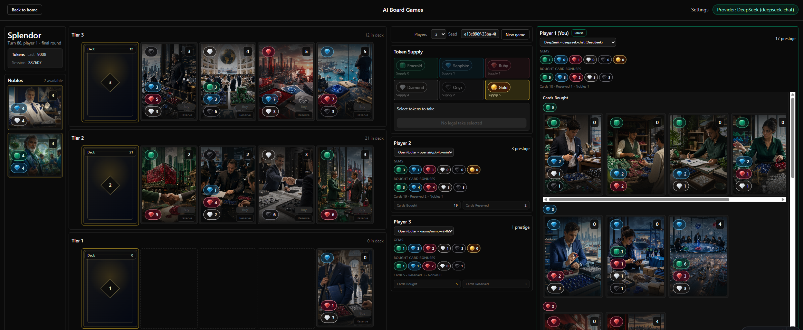
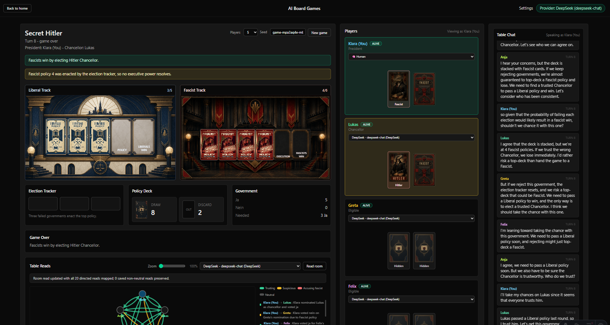

# AI Board Game Platform

**[aiboard.games](https://aiboard.games)** — a browser-based board game table where you bring your own AI provider key and play against configurable AI opponents.

Built with Astro, Svelte, TypeScript, and Tailwind CSS. All game state and provider settings stay local in the browser.

## Games

| Game | Status | Players |
| --- | --- | --- |
| Splendor | Playable | 2-4 |
| Secret Hitler | Playable | 5-10 |
| Exploding Kittens | Playable | 2-5 |

## Screenshots

### Splendor

### Secret Hitler

